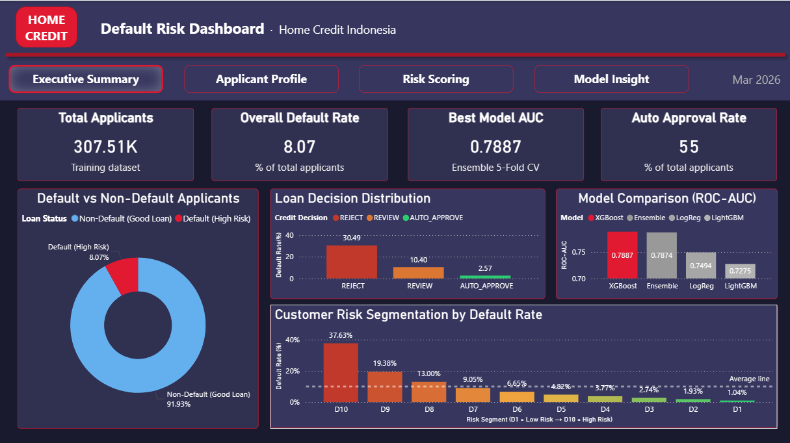
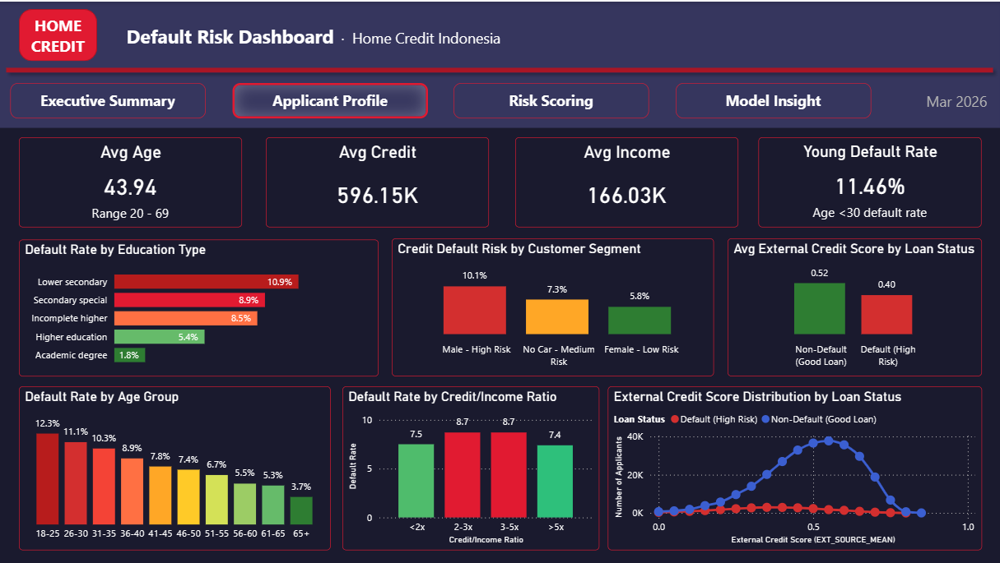
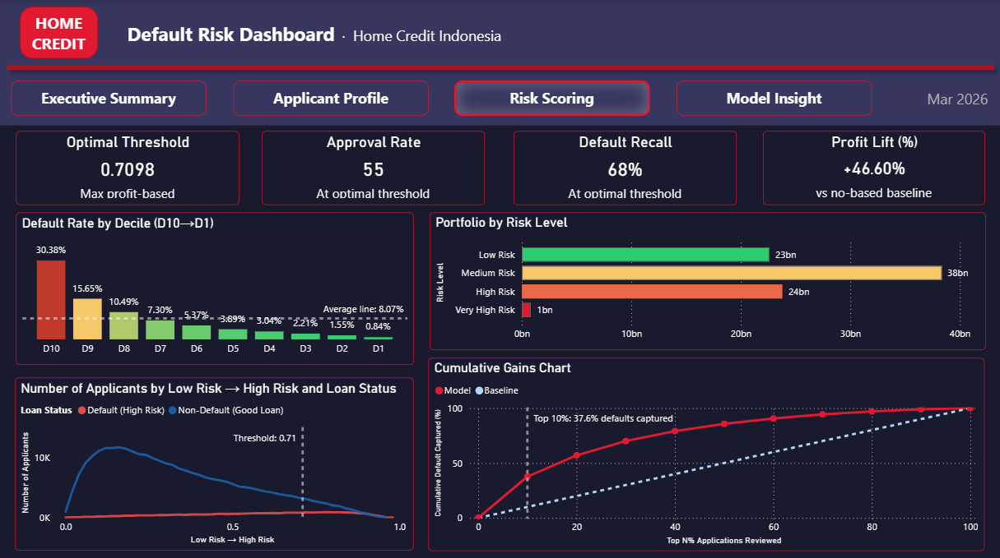
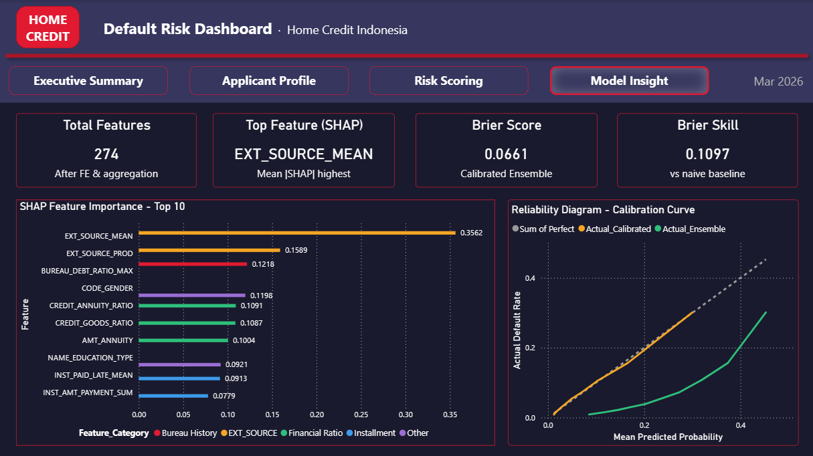

# Home Credit Default Risk — Credit Risk Analytics Dashboard


## Overview
End-to-end credit risk analytics project using the Home Credit Indonesia dataset (307K applicants).
Built a machine learning pipeline to predict loan default probability and translate model outputs
into actionable business decisions through a 4-page Power BI dashboard.

## Dashboard Pages
| Page | Description |
|------|-------------|
| Executive Summary | KPI overview, default distribution, model comparison, risk segmentation |
| Applicant Profile | Demographic analysis, age/education/gender default rates, EXT_SOURCE distribution |
| Risk Scoring | 3-tier credit policy, decile analysis, cumulative gains chart |
| Model Insight | SHAP feature importance, calibration curve, model comparison table |

## Screenshots
### Executive Summary


### Applicant Profile


### Risk Scoring


### Model Insight


## Model Performance
| Model | ROC-AUC | PR-AUC |
|-------|---------|--------|
| XGBoost | 0.7887 | — |
| Ensemble | 0.7874 | — |
| LogReg | 0.7494 | — |
| LightGBM | 0.7275 | — |

**Best Model:** XGBoost (ROC-AUC 0.7887, 5-Fold CV)

## Business Impact
- Auto-approve rate: **55%** of applicants
- Profit lift vs baseline: **+46.6%**
- Top 10% riskiest applicants capture **37.6%** of all defaults
- Optimal threshold: **0.71** (profit-based optimization)

## Key Features (SHAP)
1. EXT_SOURCE_MEAN — External credit score aggregate
2. EXT_SOURCE_PROD — Product of external scores
3. BUREAU_DEBT_RATIO_MAX — Max debt ratio from credit bureau
4. CODE_GENDER — Applicant gender
5. CREDIT_ANNUITY_RATIO — Credit to annuity ratio

## Tech Stack
- **Python** — pandas, scikit-learn, LightGBM, XGBoost, SHAP
- **Power BI** — Dashboard & visualization
- **Google Colab** — Model training environment
- **Dataset** — [Home Credit Default Risk (Kaggle)](https://www.kaggle.com/c/home-credit-default-risk)

## Files
```
├── notebook/
│   └── home_credit_pipeline.ipynb
├── data/pbi_exports/
│   ├── pbi_applicant_profile.csv
│   ├── pbi_risk_scoring.csv
│   ├── pbi_model_performance.csv
│   ├── pbi_feature_importance.csv
│   ├── pbi_decile_summary.csv
│   ├── pbi_tier_summary.csv
│   ├── pbi_kpi_summary.csv
│   ├── pbi_calibration_curve.csv
│   └── pbi_model_kpi.csv
├── dashboard/
│   └── home_credit_dashboard.pbix
├── assets/
│   ├── executive_summary.png
│   ├── applicant_profile.png
│   ├── risk_scoring.png
│   └── model_insight.png
└── README.md
```

## How to Use
1. Clone repo
2. Open `dashboard/home_credit_dashboard.pbix` with Power BI Desktop (free)
3. Update data source paths to local `data/pbi_exports/` folder
4. Refresh data